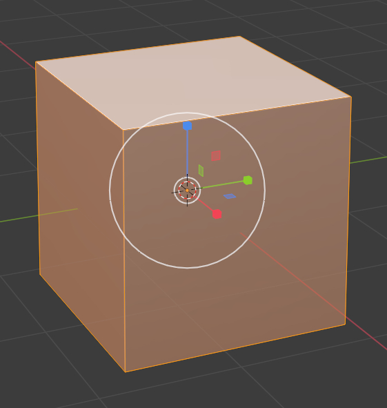
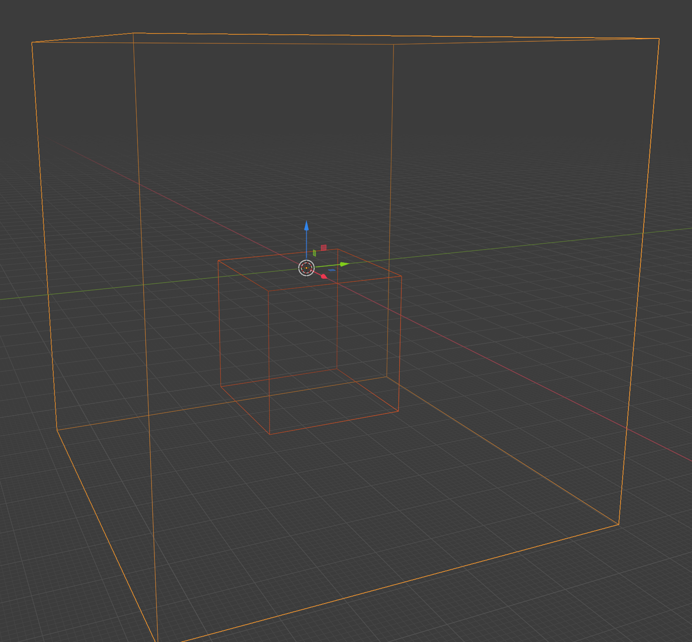

# Procedural Cliff Generator
A .blend template file for procedural cliffs and rocks based on the particle system.

## Components

The .blend file contains three different collections each with different tasks. To customize your meshes you just have to work with the first two collection. The third collection only contains utility objects which should be ok to work for most use cases.

### Particle

The particle mesh can or should be modified by your liking. Different sizes or even sculpted base meshes can have huge effects on the result.

Not all modifiers on the particle mesh are required. The further down the line they are the more optional they become. The 'Level of Detail 0' modifier should always be applied when the mesh is used in games because it greatly reduces the number of polys. All the following LOD stages are halving the face count of the previous one. The 'Planar Decimate' and 'Weld Vertices' modifiers help to reduce very tiny faces that might be unwanted. If you want the mesh have a flat base, just apply the 'Ground Cut' modifier.

### Emitter Volume

The emitter volume can be edited to give the resulting cliff or rock the desired shape. The bigger the emitter volume gets, the more particles should be spawned by the emitter to get a decent density.

### Container Volume

The container volume is used while combining the particle instances to a solid mesh to be used with more modifiers in the next steps. If your emitter mesh exceeds the bounding volume of the container, you will have to modify its size to contain all your particles.

### Ground Volume

The ground volume is used when cutting the produced mesh in the 'Ground Cut' stage of the particle modifiers. Again, if your mesh is bigger than the bounds of this mesh, you will most likely want to increase its size.

## Mesh Generation

The most important parameters for the generation process besides the base meshes of the particle and emitter are

**Emitter**
* Number of emitted particles in the particle settings
* Seed in the particle settings
* Rotation of the particle in the particle settings

**Particle**
* Decimation ratio in the 'Level of Detail 0' modifier
* Angle in the 'Planar Decimate' modifier

Just apply all the modifiers you want your mesh to include from top to bottom. If your mesh should contain different LOD stages, just duplicate the particle object before applying the modifiers and activate the required LOD level and all levels before that. Later you can auto smooth the mesh to get some nice normals.

The mesh is missing UVs and have to be created seperately. This is because I am using a triplanar shader when using the meshes in my game engine.
